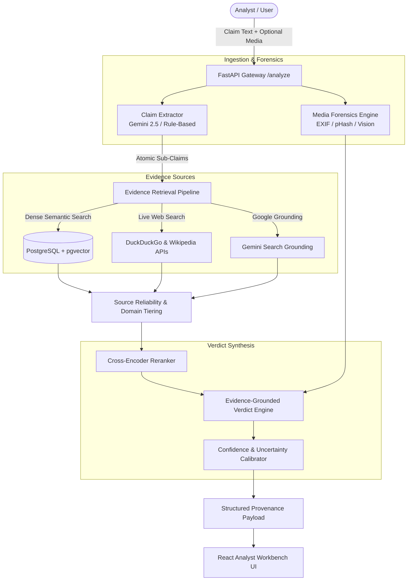

# 🔍 EvidenceLens — Multimodal Claim Verification & Provenance Workbench

[](https://fastapi.tiangolo.com)
[](https://reactjs.org/)
[](https://www.typescriptlang.org/)
[](https://github.com/pgvector/pgvector)
[](https://aistudio.google.com/)
[](LICENSE)

**EvidenceLens** is an end-to-end multimodal claim verification and forensic provenance system. It accepts complex claims (social media posts, breaking news assertions, transcripts) along with optional media files (images or video clips), extracts atomic sub-claims, retrieves multi-source evidence, performs visual reverse forensics, and synthesizes evidence-grounded verdicts with explainable reasoning chains and confidence calibration.

---

## 🌟 Key Capabilities

1. **Multimodal Claim Decomposition**
   - Extracts atomic factual propositions from complex compound statements.
   - Decomposes narrative text into verifiable claims using Google Gemini (with deterministic rule-based fallback).

2. **Hybrid Evidence Retrieval & Provenance**
   - **Dense Semantic Retrieval:** 384-dimensional vector embeddings powered by `sentence-transformers` and PostgreSQL `pgvector`.
   - **BM25 Lexical Matching:** Hybrid sparse-dense candidate ranking.
   - **Live Web Verification:** DuckDuckGo Web Search API, Wikipedia API, and Google Search Grounding for real-time validation.
   - **Source Credibility & Diversity:** 4-tier domain classification (Tier 1 peer-reviewed / institutional down to Tier 4 blocked spam), domain diversity caps, and promotional/stock photo filters.

3. **Media Forensics & Visual Provenance**
   - **Perceptual Hashing:** Multi-algorithm hashing (`pHash`, `dHash`, `aHash`, `wHash`) for robust near-duplicate and reuse detection.
   - **Metadata & EXIF Extraction:** Camera signatures, timestamps, GPS data, and software tampering indicators.
   - **Context Mismatch Detection:** Identifies recycled media (e.g., historical flood photos re-captioned as current events).
   - **Multimodal Visual Reasoning:** Vision LLM analysis for discrepancy detection between image content and claim narratives.

4. **Evidence-Grounded Verdict Engine**
   - Evaluates sub-claims against retrieved evidence items (`SUPPORTS`, `CONTRADICTS`, `CONTEXT_MISMATCH`).
   - Generates calibrated aggregate confidence scores and overall verdicts (`SUPPORTED`, `CONTRADICTED`, `MIXED`, `INSUFFICIENT_EVIDENCE`).
   - Produces step-by-step transparent reasoning chains and structured uncertainty warnings.

5. **Interactive Analyst Workbench**
   - High-performance React 18 + TypeScript + Tailwind CSS user interface.
   - Sub-claim breakdown tree and interactive evidence inspection cards.
   - Visual media forensics comparison viewer and provenance timeline.
   - Human-in-the-loop analyst stance override and report export.

---

## 🏗️ Architecture & Verification Flow



---

## 📁 Repository Structure

```
EvidenceLens-Claim Verification/
├── backend/
│   ├── alembic/              # Database migration versions & env
│   ├── app/
│   │   ├── api/routes/       # FastAPI endpoints (/analyze, /evidence, /health)
│   │   ├── core/             # Settings, DB session, vector configurations
│   │   ├── ingestion/        # Document chunking, embedding, vector ingestion
│   │   ├── models/           # SQLAlchemy ORM models (EvidenceChunk)
│   │   ├── schemas/          # Pydantic schemas (Claim, Evidence, Verdict)
│   │   └── services/         # Claim extractor, retriever, media forensics, verdict engine
│   ├── scripts/              # Verification and DB diagnostic scripts
│   ├── tests/                # Unit and integration test suite
│   ├── .env.example          # Clean environment variables template
│   └── requirements.txt      # Python dependencies
├── frontend/
│   ├── public/               # Static assets & icons
│   ├── src/
│   │   ├── api/              # API clients & TypeScript types
│   │   ├── components/       # UI components (ClaimBreakdown, EvidencePanel, MediaForensics)
│   │   └── pages/            # LandingPage, ResultsPage
│   ├── .env.example          # Frontend configuration template
│   └── package.json          # Node dependencies & scripts
├── evidence_corpus/          # Curated benchmark documents and metadata
├── docs/
│   ├── API_CONTRACT.md       # Full API contract & schema specification
│   └── FRONTEND_API_REQUIREMENTS.md
├── .gitignore                # Git ignore rules (protects keys & secrets)
└── README.md                 # Project documentation
```

---

## 🔐 Security & Secret Management

> [!IMPORTANT]
> **Never commit `.env` or sensitive API keys to source control.**
> All `.env` files are ignored by git (`.gitignore`). Always use the provided `.env.example` templates to set up local environments.

If `GEMINI_API_KEY` is not provided, EvidenceLens automatically falls back to deterministic local mock extractors and rule-based analyzers, ensuring you can run, test, and develop offline safely.

---

## 🚀 Quick Start Guide

### Prerequisites
- **Python:** 3.11 or higher
- **Node.js:** 18+ & **npm** / **pnpm**
- **PostgreSQL:** (Optional, for local pgvector store — local mock fallbacks available)

---

### 1. Backend Setup

```bash
# 1. Navigate to backend directory
cd backend

# 2. Create and activate a Python virtual environment
python -m venv .venv
# On Windows (PowerShell):
.venv\Scripts\Activate.ps1
# On Linux/macOS:
source .venv/bin/activate

# 3. Install dependencies
pip install -r requirements.txt

# 4. Create your environment configuration file
cp .env.example .env

# 5. (Optional) Run migrations if PostgreSQL is running
alembic upgrade head

# 6. Start the FastAPI development server
uvicorn app.main:app --reload --port 8000
```

The interactive API documentation is available at:
- **Swagger UI:** [http://localhost:8000/docs](http://localhost:8000/docs)
- **ReDoc:** [http://localhost:8000/redoc](http://localhost:8000/redoc)

---

### 2. Frontend Setup

```bash
# 1. Open a new terminal and navigate to frontend directory
cd frontend

# 2. Install dependencies
npm install

# 3. Create your frontend environment configuration
cp .env.example .env

# 4. Start Vite development server
npm run dev
```

The application will be live at **[http://localhost:5173](http://localhost:5173)**.

---

## ⚙️ Environment Variables Reference

### Backend (`backend/.env`)

| Variable | Required | Default | Description |
|---|---|---|---|
| `DATABASE_URL` | No | `""` | PostgreSQL connection string with `pgvector` extension. |
| `GEMINI_API_KEY` | No | `""` | Google Gemini API key for live LLM extraction & vision analysis. |
| `CORS_ORIGINS` | No | `http://localhost:5173` | Comma-separated allowed frontend origins. |
| `MAX_UPLOAD_BYTES` | No | `20971520` | Maximum media upload size in bytes (20 MB). |
| `APP_ENV` | No | `development` | Application environment (`development` or `production`). |

### Frontend (`frontend/.env`)

| Variable | Required | Default | Description |
|---|---|---|---|
| `VITE_API_BASE_URL` | No | `http://localhost:8000` | Target FastAPI backend URL. |
| `VITE_USE_MOCKS` | No | `false` | Enable pure frontend mocking mode. |

---

## 📚 Ingestion & Corpus Indexing

To load and index the curated evidence corpus into PostgreSQL pgvector:

```bash
cd backend
python -m app.ingestion.ingest
```

---

## 🧪 Testing & Verification

Run the comprehensive automated test suite (90+ tests covering claim extraction, retrieval, media forensics, reliability rating, and verdict engines):

```bash
cd backend
pytest -v
```

Run frontend linting and build validation:

```bash
cd frontend
npm run build
```

---

## 📡 Core API Specification

For detailed endpoint specifications and JSON schemas, refer to [`docs/API_CONTRACT.md`](docs/API_CONTRACT.md).

| Method | Endpoint | Description |
|---|---|---|
| `GET` | `/health` | Health & database connectivity status probe |
| `POST` | `/analyze` | Submit claim text & optional media for verification |
| `GET` | `/evidence/{id}` | Retrieve complete metadata & context for an evidence item |

---

## 🌿 Git Branching Strategy

| Branch | Description |
|---|---|
| `main` | Production releases |
| `dev` | Shared integration branch |
| `var_dev` | Backend feature development |
| `har_dev` | Frontend feature development |

---

## 📄 License

This project is licensed under the [MIT License](LICENSE).
